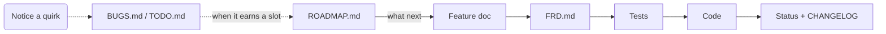

# Docs-Driven Development Approach

**Version:** 1.5 · **Last updated:** 2026-09-15

<!-- Bump both whenever this document's rules or templates change. -->

## Glossary

- **Feature** – a user-visible behavior. One feature = one document.
- **FRD** – index of all features.
- **Todo** – ideas not yet promoted to features.
- **Bug** – a defect or debt item in shipped behavior; not a feature.
- **Roadmap** – the order to work Todo and Bug items in. Holds no behavior.
- **Epic** – a named group of items worked as one stretch.

## Philosophy

- Docs are the contract. Code just proves it.
- Docs → Tests → Code. Never the other order.
- Short docs get updated. Long docs get skipped.
- See a gap? Write it down now, not later.

## Rules

- Changed behavior edits the existing document; new behavior gets a new ID.
- Reference an ID as `#<PREFIX>-NNNN` in commit messages, code comments, and
  prose mentions that aren't linking to the doc itself (e.g. `paging #MDV-0018`).
  When linking to the feature doc from within `docs/`, use a real Markdown link
  (`[<PREFIX>-NNNN](<PREFIX>-NNNN-slug.md)`), not a bare mention.
- Every top-level function/class implementing a feature carries the `#<PREFIX>-NNNN`
  IDs it implements, either as a comment directly above it or as the first line of its
  docstring (multiple IDs, comma-separated).

## Visuals

| What you describe | Form |
| --- | --- |
| One fact | Sentence |
| A choice or a gate | Table |
| Ordered steps, branches | `mermaid` flowchart |
| States and transitions | `mermaid` stateDiagram |
| Paths, trees, layout | Fenced ASCII |
| Two axes (item × target) | Table |

- If the prose is longer than the drawing, delete the prose.
- Label every branch. An unlabeled arrow is not a spec.
- `mermaid` renders on GitHub and GitLab. Text piped elsewhere (a package
  description, `--help` output) stays a table or ASCII.

## Directory layout

```text
docs/
  FRD.md
  TODO.md
  BUGS.md
  ROADMAP.md  # optional
  CHANGELOG.md
  features/
    TEMPLATE.md
    EXAMPLE.md
    <PREFIX>-NNNN-slug.md
```

- `<PREFIX>` = project code.
- IDs are sequential and never reused.

## Workflow

1. Create a feature doc.
2. Add it to `FRD.md`.
3. Write tests.
4. Implement.
5. Update status.
6. If implemented or deprecated, add a changelog entry.

Steps 1–6 are for a specific feature.



The dotted path runs at any time, from anywhere.

## FRD.md template

```markdown
# Feature Requirements Document

## Available Features

- [X] [<PREFIX>-0001. <Feature Name>](features/<PREFIX>-0001-slug.md) - `#tag1` `#tag2`
- [ ] [<PREFIX>-0002. <Feature Name>](features/<PREFIX>-0002-slug.md) - `#tag2`

## Tags

- `#tag1`: <PREFIX>-0001, <PREFIX>-0003
- `#tag2`: <PREFIX>-0001
```

`[X]` = `Implemented`, `[ ]` = `Planned` or `Deprecated` — the checkbox mirrors the
feature doc's own `## Status`, so it stays in sync when status changes. Uppercase `X`
is `markdownfmt`'s normalized form.

Tags are for cross-feature navigation only - use them to group related features.

## Feature document template (`docs/features/TEMPLATE.md`)

```markdown
# ABC-0001. Feature name

**Tags:** #tag1 #tag2

## User Story

## Behavior

## Implementation

## Quirks & Decisions

## Testing

## Status
```

`## User Story` is one sentence: "As a `<role>`, I want `<goal>`, so that `<benefit>`."
The role is whoever directly experiences the behavior — a terminal user, a script
piping input, a contributor writing a plugin — not "the system".

`## Quirks & Decisions` lists every accidental or debatable behavior found while
writing the doc, each as either `- Quirk: <what happens and why it's off>` followed by
`Proposed: <concrete target behavior>`, or `- Quirk: <what happens>` followed by
`Open: <the design question that needs an answer>`.

Omit sections that don't apply. Status is one of: `Planned`, `Implemented`, `Deprecated`.

`## Behavior` and `## Implementation` may be a table or a diagram. Same rules as
Visuals.

## Feature document example (`docs/features/EXAMPLE.md`)

```markdown
# GWS-0008. Single-instance enforcement

**Tags:** #process

## User Story

As an operator starting the service, I want a second launch to replace the running
instance instead of failing or running alongside it, so that I never end up with two
instances silently competing.

## Behavior

Starting a second instance replaces the running one. The new instance always
continues startup.

## Implementation

- Read the pidfile.
- Ignore missing, invalid, or foreign PIDs.
- Send `SIGTERM` to the existing instance.
- Wait up to 5 seconds for exit.
- Continue startup regardless.

The existing instance exits on `SIGTERM`.

## Testing

### Human

- Start two instances. The first exits, the second keeps running.
- Verify the pidfile contains the second instance's PID.
- Stop the first instance with `SIGSTOP`. The second starts after ~5 seconds.

### Unit

- Missing or invalid pidfile.
- Pidfile points to another executable.
- Pidfile contains the current process PID.

### Integration

- Starting two instances leaves only the second running.
- An unresponsive first instance does not block startup.

## Status

Implemented
```

## TODO.md template

```markdown
# Features to add

- <one-line idea>
```

Remove the line once promoted to a feature doc.

## BUGS.md template

```markdown
# Bugs & debt

Next free ID: **BUG-0001**.

Each entry ends with a `[P#/D#]` marker:

Priority:   P1 = high     P2 = medium   P3 = low
Difficulty: D1 = trivial  D2 = small    D3 = medium   D4 = large

## Bugs & quirks

- #BUG-0001 <one-line defect> [P#/D#]

## Tech debt

- #BUG-0002 <one-line debt item> [P#/D#]

## Chores

- #BUG-0003 <one-line chore> [P#/D#]
```

Defects, quirks, tech debt, and chores on already-shipped behavior go here, not in
`TODO.md` (new behavior only). IDs share one sequence across sections, never reused
or renumbered — deleting a fixed entry leaves a gap. Group entries under an
area-specific `###` subheading (e.g. `### Downloads / cache`) when a section grows
past a handful — the three `##` sections are mandatory, subheadings are just
navigation.

## ROADMAP.md template

Optional. Add one when `BUGS.md` and `TODO.md` stop fitting on a screen.

```markdown
# Roadmap

| # | Epic | Why here |
| --- | --- | --- |
| 1 | <name> | <one line> |

## 1. <Epic name>

1. #BUG-0001 — <why this one first>
2. #TODO-0003 — <why this one next>

**Done when:** <one observable thing>
```

- Order, not scope. An item's contract stays in its feature doc.
- Delete an item here when its `BUGS.md`/`TODO.md` entry is deleted — same commit.
- Never a blocker. If the work proves the order wrong, fix the roadmap after.

## CHANGELOG.md template

```markdown
# Changelog

## Unreleased

- <PREFIX>-NNNN: <one-line summary>

## <YYYY-MM-DD or version>

- <PREFIX>-NNNN: <one-line summary>
```

Rules:

- Newest releases first; within `## Unreleased`, newest entries first.
- One line per feature - the feature document has the details.
- On release, rename `## Unreleased` to the version/date and start a new
  `## Unreleased` section above it.

## Adopting this approach

1. Create the directory structure above, with empty `FRD.md`, `TODO.md`,
   `BUGS.md`, and `CHANGELOG.md`, and `TEMPLATE.md`/`EXAMPLE.md` copied into
   `features/`.
2. Add the Rules section to your project's `CLAUDE.md` or `AGENTS.md`.
3. Choose a project prefix and start numbering at `0001`.

## Known trade-offs

- `FRD.md` and its tag index are maintained manually.
- Sequential IDs are stable references but don't provide thematic grouping.
- Best suited to projects with roughly dozens - not hundreds - of features.
- The roadmap drifts unless pruned in the same commit that closes an item.
