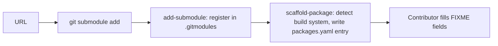

# COPR-0001. Add a new package from an upstream URL

**Tags:** #packages #onboarding

## User Story

As a contributor onboarding a new upstream project, I want one command to register its
git submodule and scaffold its `packages.yaml` entry, so that I don't have to hand-write
the submodule registration and the YAML boilerplate separately.

## Behavior

`make add-new URL=<repo-url>` adds the git submodule under `submodules/<org>/<name>`,
registers it (`ignore = dirty` in `.gitmodules`), and writes a scaffolded
`packages.yaml` entry — detecting the build system (`cmake`/`meson`/`autotools`/`make`/
`python`) and filling in what it can (license, summary, `depends_on` guessed from
`build_requires` matching existing package names, Python build-backend `Requires`).
Fields it can't determine are left as `FIXME` for the contributor to fill in.

Step by step, the same flow is available as three separate commands (`git submodule
add`, `make add-submodule PACKAGE=<name>`, `make scaffold-package PACKAGE=<name>`) —
useful when re-scaffolding an already-registered submodule.

## Implementation

- `Makefile` `add-new`/`add-submodule` targets drive the submodule registration.
- `scripts/scaffold-package.py` + `scripts/lib/detection.py` do the build-system and
  Python-project detection (PEP 621/Poetry metadata, `setup.py` regex fallback) and
  write the `packages.yaml` entry.
- `make list-tags PACKAGE=<name>` (or with no `PACKAGE`, for all submodules) shows
  available upstream tags first, if useful before scaffolding.

## Quirks & Decisions

- Quirk: `add-submodule`/`add-new` still embed real logic (yaml edits, git submodule
  surgery) directly in Makefile recipes instead of `scripts/*.py`, so it's untestable
  by pytest; `delete-package` still holds submodule surgery and the volume sweep in the
  Makefile recipe after its script call.
  Proposed: move both into `scripts/*.py`, matching `scaffold-package.py`, which
  already fully delegates and is tested. (BUG-0070)

## Testing

### Unit

- `tests/test_scaffold_package.py`, `tests/test_detection.py`.

### Integration

- `tests/integration/test_make_targets.py` exercises `add-submodule`/`scaffold-package`
  via `make -n`.

## Status

Implemented
