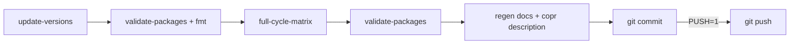

# COPR-0003. Daily update automation

**Tags:** #daily #automation #build

## User Story

As a maintainer running this unattended, I want one command that bumps versions,
builds and validates every package, regenerates docs, and commits, so that a nightly
cron job can keep the repo current without a human watching it.

## Behavior

`make update-daily COPR_REPO=<project> PUSH=1` runs: bump versions from upstream tags
→ `validate-packages` + `fmt` (packages.yaml sanity only, not the full `pre-commit`
gate) → `full-cycle-matrix` (COPR-0017: every supported chroot locally, one Copr
submission) → `validate-packages` again (no `fmt`, since the release-bump rewrite in
`full-cycle-matrix` already went through the same formatter) → regenerate docs → push
Copr description → `stage-log-analyze` → commit → push if `PUSH=1`.

A one-off package build failure doesn't abort the run — it's recorded and reported at
the very end, after docs and the commit have already happened, so a chroot-specific
mock failure never loses the night's version bumps.

## Implementation

- `Makefile` `update-daily`/`_update-daily` targets chain the steps above.
- `flock` on `logs/.pipeline.lock` (shared with `full-cycle`/`full-cycle-matrix`)
  refuses a second concurrent run instead of corrupting shared state; bypass with
  `LOCK_DISABLE=1`.
- Intended to run from an external nightly cron — the repo has no scheduler of its
  own.

## Quirks & Decisions

- Quirk: any package resubmitted tonight publishes as Copr state `unknown` in the
  generated docs; only unchanged (cached) packages show yesterday's resolved state.
  `full-cycle` submits with `--nowait` and the docs regenerate seconds later — one
  poll too early for whatever was just resubmitted.
  Open: needs a design decision (poll again before the docs step? delay docs by one
  run?). (BUG-0100 tracks the related aggregate-failure-reporting half; this specific
  one-poll-early gap is BUG-0039-shaped — see docs/CHANGELOG.md history.)
- Quirk: nothing beyond a commit message with a timestamp reports what happened each
  night — no durable nightly summary artifact.
  Proposed: see [COPR-0022](COPR-0022-run-scoped-logs-and-summary.md) (Planned).

## Testing

### Integration

- `tests/integration/test_make_targets.py`, `tests/integration/test_entry_points.py`
  cover the chained targets and the lock/failure-tolerance behavior.

## Status

Implemented
