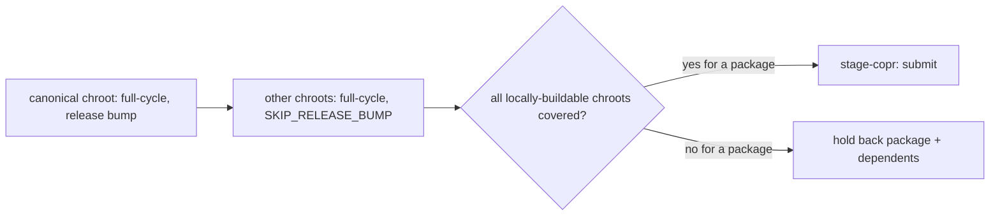

# COPR-0017. Build every supported chroot locally before submitting once

**Tags:** #build #matrix #copr

## User Story

As a maintainer, I want every supported Fedora chroot built locally before a single
Copr submission, so that a chroot-specific failure (e.g. a newer libstdc++
requirement) is caught before it reaches Copr, not only after.

## Behavior

`make full-cycle-matrix PACKAGE=<name> COPR_REPO=<project>` runs the full pipeline per
`MATRIX_VERSIONS` (default: every `SUPPORTED` version) x86_64 chroot with
`SKIP_COPR=true`, then submits once via `stage-copr`. Each chroot is a real
`matrix-chroot-<version>` Makefile target, run from a plain shell loop — one chroot
failing doesn't stop the rest. The canonical chroot (which alone bumps the release)
always builds first regardless of `MATRIX_VERSIONS`' own list order. Submission is
gated per package (COPR-0007): a package not yet verified/skipped on every
locally-buildable chroot, and its transitive dependents, are held back individually.
`update-daily` (COPR-0003) uses this instead of a single-version `full-cycle`.

## Implementation

- `Makefile` `full-cycle-matrix`/`_full-cycle-matrix`/`matrix-chroot-%` targets.
- `lib.copr.ineligible_packages()`/`block_transitive_dependents()`/
  `blackout_chroots()`.

## Quirks & Decisions

- Quirk (fixed): `_full-cycle-matrix` used to expand `MATRIX_VERSIONS` via `make -k`
  plus an order-only prerequisite, which GNU Make's own semantics silently skip past
  entirely once the canonical chroot had any package failure — three nights running
  (2026-09-07/08), only the canonical chroot ever had real coverage, so
  `ineligible_packages()` correctly blocked every package, including unrelated ones.
  Fixed by a plain shell loop that always continues to the next chroot (see
  docs/CHANGELOG.md 2026-09-08, closed #BUG-0053).
- Quirk: `matrix-chroot-%` targets build every chroot serially via a plain shell
  `for` loop, even though the chroots are independent once the canonical one has run.
  `-j` isn't supported: the canonical chroot's release-bump step writes the shared
  `packages.yaml` while every other chroot's `full-cycle` call reads it, and the
  pipeline `flock` refuses a second concurrent `make` invocation by design anyway.
  Open: needs both solved first; park until the matrix is otherwise correct before
  making it fast. (BUG-0067)
- Quirk: aarch64 chroots have no local build path at all — they always report "not
  verifiable locally" and can never satisfy `REQUIRE_CHROOT_COVERAGE`.
  Open: see [COPR-0020](COPR-0020-aarch64-local-builds.md) (Planned). (BUG-0018)

## Testing

### Integration

- `tests/integration/test_make_targets.py`, `tests/integration/test_entry_points.py`.

## Status

Implemented
