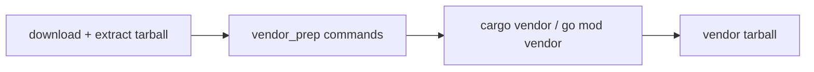

# COPR-0025. Pre-vendor source preparation

**Tags:** #packaging #tooling

## User Story

As a packager adding a Rust or Go project whose workspace/module includes a git-source
dependency alongside otherwise-vendorable crates/modules, I want to trim or patch the
extracted source tree before `cargo vendor`/`go mod vendor` runs, so that the vendor
stage sees a shape it can actually resolve offline instead of failing outright on the
whole package.

## Behavior

`build.vendor_prep` is an optional list of shell commands run in the extracted,
downloaded source tree, immediately before the language-specific vendor tool
(`cargo vendor` / `go mod vendor`). Each command is executed in order with the source
root as its working directory; the first failing command aborts the vendor stage with
its exit output, the same way a `cargo vendor` or `go mod vendor` failure does.

This is distinct from `build.prep`, which runs inside `%prep` in the mock chroot on the
pristine tarball two stages later. A package that trims its workspace for vendoring must
mirror the same edit in `build.prep`, or the chroot build will attempt to compile the
members `vendor_prep` excluded and fail for the same reason vendoring would have.

## Implementation

- `scripts/lib/vendor.py` `generate()` — after `_extract()`, before dispatching to
  `lib.vendor_rust`/`lib.vendor_golang`, each `pkg_meta["build"]["vendor_prep"]` entry
  runs via `lib.subprocess_utils.run_cmd(..., shell=True, cwd=src_dir)`; a non-zero exit
  raises `VendorError` naming the failed command.
- `scripts/lib/validation.py` — `"build.vendor_prep": list` in the type map.
- `packages.yaml.example` — documented in the cargo example and the `build:` key summary
  at the top of the file.

## Quirks & Decisions

- Quirk: the content hash that gates re-vendoring (`lib.cache.compute_input_hashes`'s
  `content` key) already hashes the full package metadata minus `release`, so a change to
  `vendor_prep` alone correctly invalidates a cached vendor tarball without any extra
  wiring.
- Decision: language-agnostic by construction — it runs before the `cargo`/`golang`
  branch point in `lib.vendor.generate()`, not inside either backend — so Go packages get
  the same hook for free, even though the first consumer (`openlogi`) is a cargo package.

## Testing

### Unit

- `tests/test_vendor.py` — `vendor_prep` commands run in order in `src_dir` before the
  language backend is invoked; a failing command raises `VendorError`; absent/empty
  `vendor_prep` is a no-op (regression guard for every existing package, none of which
  sets it).
- `tests/test_validation_gaps.py` — `build.vendor_prep` must be a list; a string is
  rejected.

## Status

Implemented
